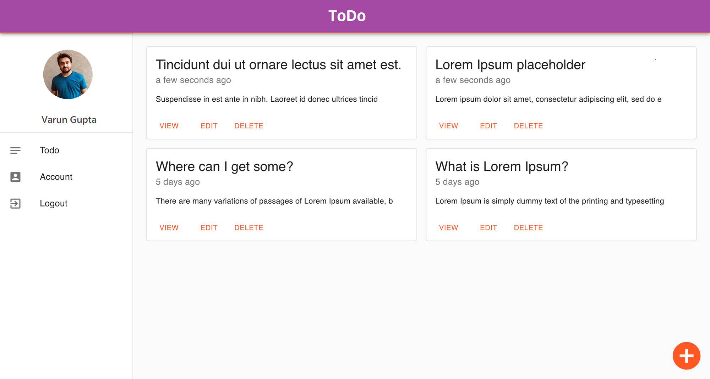

# This is a Todo Application using React.JS and Firebase NoSQL database

### Application:

### Application Architecture:

### Components used in the Application:

1. ReactJS - React is a free and open-source front-end JavaScript library for building user interfaces or UI components.

2. Firebase Firestore - Cloud Firestore is a NoSQL document database that lets you easily store, sync, and query data for your mobile and web apps - at global scale.

3. Firebase Functions - Cloud Functions for Firebase is a serverless framework that lets you automatically run backend code in response to events triggered by Firebase features and HTTPS requests.

4. Firebase Authentication - Firebase Authentication provides backend services, easy-to-use SDKs, and ready-made UI libraries to authenticate users to your app.

5. Material UI - Material UI is an open-source, front-end framework for React components.
