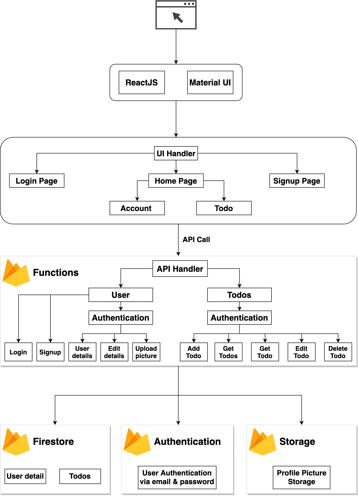

# This is a Todo Application using React.JS and Firebase NoSQL database

-----

### Account creation:

### Todo Dashboard:

### Application Architecture:

### Components used in the Application:

1. ReactJS
2. Material UI
3. Firebase Firestore, Functions and Authentication
4. ExpressJS
5. Postman.